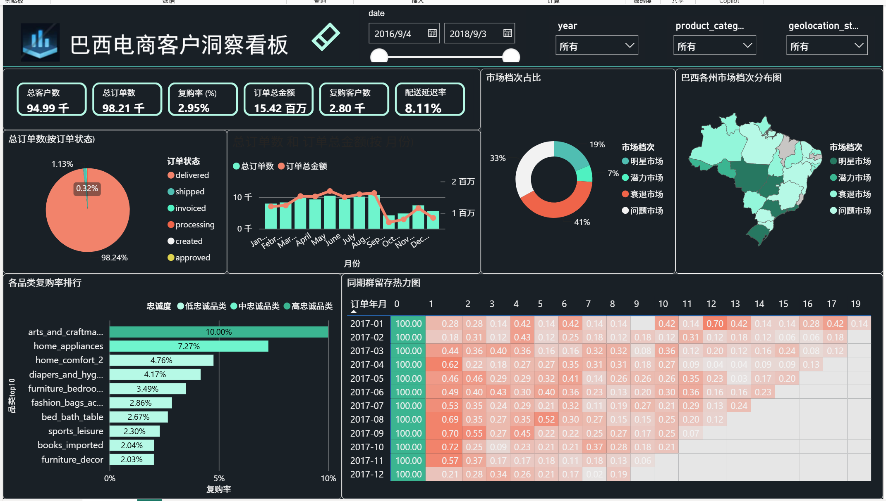
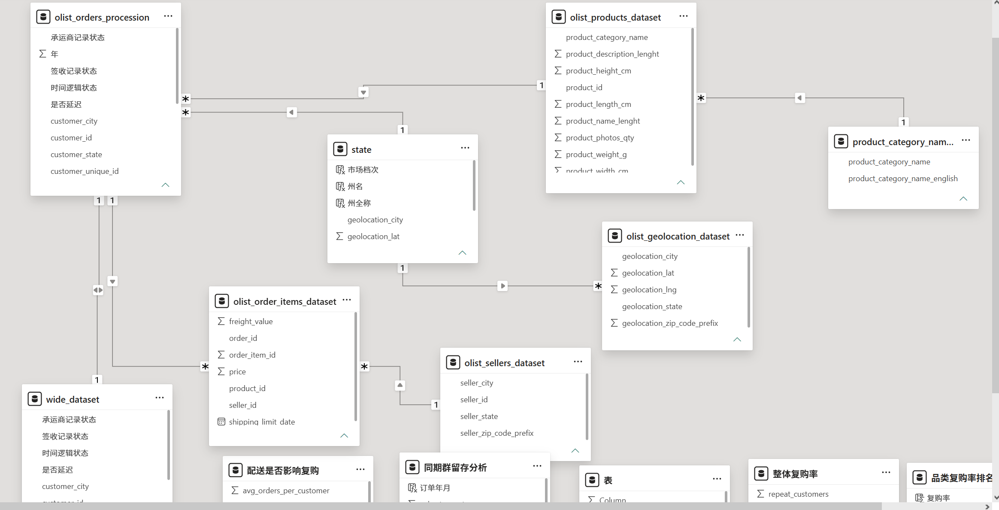

# 📊 Olist 巴西电商客户留存分析

> 基于 Olist 公共数据集，使用 Excel + SQL + Power BI 完成端到端的客户留存分析与交互式仪表板


## 📌 项目概述

本项目围绕 **“Olist 客户复购率远低于行业水平”** 这一核心业务问题，完整经历了数据清洗、深度分析和可视化展示的全流程，最终产出一份可直接用于业务决策的交互式仪表板。

**核心发现**：
- Olist 客户复购率仅 **2.95%**，远低于电商行业 20-30% 的平均水平
- 客户在首次购买后的 **第 2 个月流失最严重**（留存率从 100% 骤降至不足 1%）
- 首单延迟的客户复购率比首单准时客户 **低约 0.62%**
- `arts_and_craftmanship` 品类复购率最高（10%），是重点发展品类


## 🎯 业务问题

Olist 是巴西最大的电商平台之一，连接了全国各地的卖家和买家。尽管平台流量可观，但 **客户复购率极低**——这是制约其长期增长的核心瓶颈。

**本项目要回答的 5 个关键问题**：

| 编号 | 问题 | 分析维度 |
| :--- | :--- | :--- |
| Q1 | 整体复购率有多低？ | 客户行为 |
| Q2 | 客户在什么时候流失？ | 同期群留存 |
| Q3 | 配送速度是否影响复购？ | 物流体验 |
| Q4 | 哪些品类的客户忠诚度最高？ | 品类运营 |


## 🛠️ 工具与技能

| 工具 | 用途 | 关键技能 |
| :--- | :--- | :--- |
| **Excel** | 数据清洗、初步探索 | VLOOKUP、数据透视表、条件格式 |
| **SQL (MySQL)** | 数据建模、深度分析 | CTE、窗口函数、聚合查询、多表关联 |
| **Power BI** | 交互式仪表板 | DAX、数据建模、可视化设计 |


## 📊 数据来源

- **数据集**：[Olist Brazilian E-Commerce Public Dataset](https://www.kaggle.com/datasets/olistbr/brazilian-ecommerce) (Kaggle)
- **时间范围**：2016年9月 至 2018年8月
- **数据规模**：~99,441 订单，~96096 客户，9 张关联表


## 📁 项目结构
```
olist-customer-retention-analysis/
│
├── README.md                          # 项目说明文档
│
├── excel预处理与基础分析/              # Excel 清洗与初步分析
│   ├── olist_orders_procession.xlsx      # 清洗后的主表
│   ├── state.xlsx                     # 州维度表
│   ├── wide_dataset.xlsx              # 宽表（合并后主表）
│   └── 电子商务销售数据（数据透视表作图分析）.xlsx  # 数据透视表分析
│
├── sql/                               # SQL 分析
│   ├── 电子商务销售.sql                # 完整 SQL 脚本
│   └── 结果/                          # SQL 查询结果
│       ├── 整体复购率.csv
│       ├── 同期群留存分析.csv
│       ├── 配送是否影响复购.csv
│       └── 品类复购率排名 + 忠诚度分类.csv
│
├── powerbi/                           # Power BI 仪表板
│   └── 电子商务销售.pbix              # Power BI 文件
│
├── 数据/                              # 数据集
│   ├── 原始数据/                      # Kaggle 原始数据（9张表）
│   │   ├── olist_customers_dataset.csv
│   │   ├── olist_geolocation_dataset.csv
│   │   ├── olist_order_items_dataset.csv
│   │   ├── olist_order_payments_dataset.csv
│   │   ├── olist_order_reviews_dataset.csv
│   │   ├── olist_orders_dataset.csv
│   │   ├── olist_products_dataset.csv
│   │   ├── olist_sellers_dataset.csv
│   │   └── product_category_name_translation.csv
│   └── Excel清洗后的数据/              
        └── olist_orders_dataset.png    # 清洗后数据
│
└── docs/                              # 文档与截图
    ├── 仪表板截图.png                       # Power BI 仪表板截图
    └── 表关系图.png                   # Power BI 数据模型关系图
```


## 📈 分析过程

### 阶段一：Excel 数据清洗与初步探索

**目标**：将原始表整合为一张干净的分析宽表，并对巴西销售基本情况进行初步探索。

**主要操作**：
1. **数据清洗**：处理缺失值、异常值(进行异常标注），过滤无效订单（`canceled`、`unavailable`）
2. **表合并**：使用 VLOOKUP 合并订单核心表、订单明细表、客户信息表
3. **创建辅助列**：`订单年月`、`配送天数`、`是否延迟`
4. **初步可视化**：基于数据透视表制作 5 张核心图表（品类信息在 SQL 阶段关联补充）

**输出**：`excel预处理与基础分析/电子商务销售数据（数据透视表作图分析）t.xlsx`

**5 张初步分析图表**：

| 图表名称 | 分析目的 | 关键发现 |
| :--- | :--- | :--- |
| **月度订单趋势** | 观察 2016-2018 年每月订单量变化 | 订单量呈上升趋势，2017 Q4 和 2018 Q4 为订单高峰 |
| **年度订单趋势** | 对比各年订单总量 | 2017 年订单量较 2016 年大幅增长，2018 年持续增长 |
| **按州分组订单数** | 识别订单来源的地理分布 | SP（圣保罗）订单量最高，其次是 RJ、MG，订单集中在东南部 |
| **订单状态占比** | 了解订单履约情况 | `delivered` 状态占比最高，`canceled` 订单较少 |
| **物流是否延迟** | 初步评估配送准时率 | 大部分订单准时送达，约 **8%** 订单存在延迟 |


### 阶段二：SQL 深度分析

**目标**：回答 4个核心业务问题。

**执行环境**：MySQL

**5 个核心查询**：

| 编号 | 分析内容 | 输出表/字段 |
| :--- | :--- | :--- |
| 1 | 构建宽表（关联品类信息） | `wide_dataset` |
| 2 | 整体复购率 | `repeat_rate_overall` |
| 3 | 同期群留存 | `retention_cohort` |
| 4 | 配送影响（首单体验） | `first_order_impact` |
| 5 | 品类复购率排名 + 忠诚度分类 | `category_loyalty` |

**输出**：`sql/结果/*.csv`


### 阶段三：Power BI 可视化

**目标**：将分析结果转化为交互式仪表板。

**看板名称**：巴西电商客户洞察看板（1 页）

**看板结构**：

| 版块 | 视觉对象 | 内容 |
| :--- | :--- | :--- |
| **KPI 指标卡** | 卡片图（6个） | 总客户数、总订单数、复购率、订单总金额、复购客户数、配送延迟率 |
| **订单状态分布** | 饼图/环形图 | 按订单状态分组（delivered 98.24%、shipped、invoiced、processing、created、approved） |
| **巴西各州市场档次分布图** | 形状地图 | 按州展示市场档次与 |
| **市场档次占比** | 环形图 | 市场档次（明星市场 18.5%、潜力市场 7.4%、问题市场 33.3%、衰退市场 40.8%） |
| **同期群留存热力图** | 矩阵 + 条件格式 | 行：订单年月（2017-01 至 2017-12），列：月份差（0-19），值：留存率（%） |
| **各品类复购率排名** | 条形图 | X轴：复购率（%），Y轴：品类名称（Top 10） |

**切片器**：日期范围、年份、品类、州（部分图表联动筛选）


## 🔍 核心发现

### 发现 1：巴西销售基本情况（Excel 初步探索）

| 维度 | 关键发现 |
| :--- | :--- |
| **月度趋势** | 订单量整体呈上升趋势，2017 年 Q4 和 2018 年 Q4 为订单高峰 |
| **年度增长** | 2017 年较 2016 年大幅增长，2018 年延续增长趋势 |
| **区域分布** | SP（圣保罗）、RJ、MG 三州订单占比最高，订单集中在东南部 |
| **订单履约** | 绝大多数订单状态为 `delivered`，履约情况良好 |
| **物流延迟** | 约 10-15% 的订单存在延迟，是后续分析的重点方向 |


### 发现 2：整体复购率极低

| 指标 | 数值 |
| :--- | :--- |
| 总客户数 | 94989 |
| 复购客户数 | 2,801 |
| **复购率** | **2.95%** |

> 远低于电商行业 20-30% 的平均水平，客户留存是 Olist 最大的增长机会点。


### 发现 3：客户在第 2 个月流失最严重

同期群留存分析显示：

| 月份差 | 留存率范围 | 说明 |
| :--- | :--- | :--- |
| 0（首月） | 100% | 所有客户都有首单 |
| 1 | 0.18% - 0.72% | 留存率骤降 99%+ |
| 2+ | < 0.4% | 几乎全部流失 |

> 客户在首次购买后的 **第 2 个月** 是流失的关键拐点，需要在首单后 30 天内进行复购干预。


### 发现 4：首单延迟的客户复购率显著更低

| 首单体验 | 客户数 | 复购率 |
| :--- | :--- | :--- |
| 首单准时 | 85,759 | 3.05% |
| 首单延迟 | 7,598 | 2.43% |

> 首单延迟的客户复购率比准时客户 **低 0.62 个百分点**，相对降幅约 **20%**。物流体验不是"锦上添花"，而是"复购的基本门槛"。


### 发现 5：品类复购率差异巨大

| 品类 | 复购率 | 忠诚度等级 |
| :--- | :--- | :--- |
| arts_and_craftmanship | 10.0% | ⭐⭐⭐ 高忠诚 |
| home_appliances | 7.27% | ⭐⭐ 中忠诚 |
| home_comfort_2 | 4.76% | ⭐ 低忠诚 |
| diapers_and_hygiene | 4.17% | ⭐ 低忠诚 |
| furniture_bedroom | 3.49% | ⭐ 低忠诚 |

> `arts_and_craftmanship` 和 `home_appliances` 的客户忠诚度最高，建议加大流量倾斜和 SKU 扩充。


### 发现 6：市场档次分布

基于订单量和复购率的 2×2 矩阵，将 27 个州划分为四档：

| 市场档次 | 州数 | 占比 | 包含州 |
| :--- | :--- | :--- | :--- |
| **明星市场** | 5 | 18.5% | GO、MT、RJ、RS、SP |
| **潜力市场** | 2 | 7.4% | AC、RO |
| **问题市场** | 9 | 33.3% | BA、CE、DF、ES、MG、PA、PE、PR、SC |
| **衰退市场** | 11 | 40.8% | AL、AM、AP、MA、MS、PB、PI、RN、RR、SE、TO |


## 🎯 业务建议

| 优先级 | 建议 | 预期效果 |
| :--- | :--- | :--- |
| 🔴 **高** | 首单后 30 天内发送复购优惠券或个性化推荐 | 提升次月留存率 |
| 🔴 **高** | 改善物流准时率，特别是首单配送体验 | 降低首单延迟率，提升复购率 |
| 🟡 **中** | 重点投入 `arts_and_craftmanship` 品类，扩充 SKU | 提升整体复购率 |
| 🟡 **中** | 延迟订单自动补偿优惠券 | 挽回"受伤"客户 |
| 🟡 **中** | 针对"问题市场"州（订单量大但复购率低）重点优化物流和客服 | 提升高订单地区的留存率 |
| 🟢 **低** | 建立客户忠诚度会员体系 | 长期提升客户终身价值 |


## 📊 仪表板预览

### 仪表板


### 数据模型关系图



## 📌 技术亮点

| 亮点 | 说明 |
| :--- | :--- |
| **完整的数据管道** | Excel → SQL → Power BI，端到端的数据流转 |
| **业务导向的分析** | 每个查询都对应明确的业务问题 |
| **多工具协同** | 发挥各工具优势：Excel清洗、SQL建模、Power BI可视化 |
| **交互式仪表板** | 支持多维度下钻，可响应切片器筛选 |
| **方法论严谨** | 消除幸存者偏差（如 Q3 改进版按首单分组） |


## ⚠️ 局限性

1. **无客户画像**：缺少年龄、性别等人口统计信息
2. **评价数据未深度使用**：Q4 因数据缺失未完整分析
3. **未做预测建模**：当前为描述性分析，未涉及预测

## 🔄 后续扩展方向

- 使用 Python 构建客户流失预测模型（机器学习）
- 整合评价文本进行 NLP 情感分析
- 计算客户终身价值 (CLV)
- 分析卖家绩效对复购的影响


## 📚 相关链接

- [Kaggle 数据集](https://www.kaggle.com/datasets/olistbr/brazilian-ecommerce)
- [Power BI 仪表板](./powerbi/电子商务销售.pbix)
- [SQL 分析脚本](./sql/电子商务销售.sql)


## 👤 作者

Xiaoling-fighting
- GitHub：[https://github.com/xiaoling-fighting](https://github.com/xiaoling-fighting)
- Email：19583599631@163.com

---

*如果你对这个项目有任何问题或建议，欢迎通过 GitHub Issues 联系我。*
